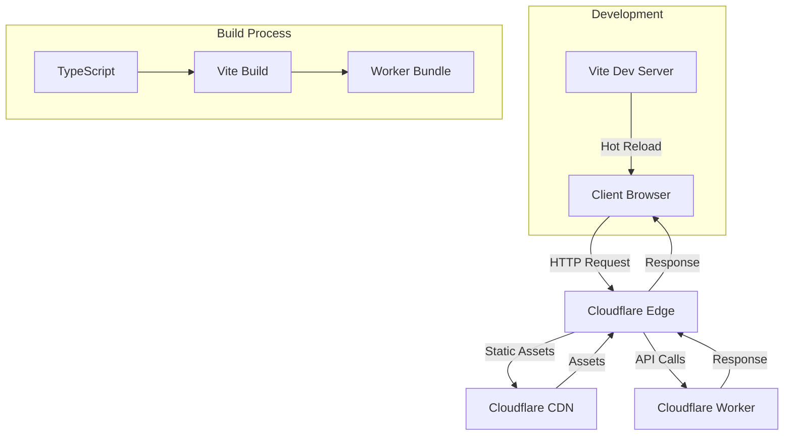

# Cloudflare Vite Examples

<div align="center">
  <svg width="200" height="150" viewBox="0 0 200 150" xmlns="http://www.w3.org/2000/svg">
    <!-- Background -->
    <rect width="200" height="150" fill="#f6f8fa"/>
    
    <!-- Cloudflare Orange Cloud -->
    <path d="M50 80 Q40 70 50 60 Q60 55 70 60 Q80 50 90 60 Q100 55 110 60 Q120 70 110 80 Z" fill="#f38020"/>
    
    <!-- Vite Lightning -->
    <path d="M130 45 L140 65 L135 65 L145 85 L125 65 L130 65 Z" fill="#646cff"/>
    <path d="M132 47 L138 63 L135 63 L143 83 L127 63 L130 63 Z" fill="#41d1ff"/>
    
    <!-- Connection Lines -->
    <line x1="90" y1="70" x2="130" y2="65" stroke="#e1e4e8" stroke-width="2" stroke-dasharray="5,5"/>
    
    <!-- Text -->
    <text x="100" y="110" text-anchor="middle" fill="#24292f" font-family="Arial, sans-serif" font-size="14" font-weight="bold">Cloudflare + Vite</text>
    <text x="100" y="125" text-anchor="middle" fill="#656d76" font-family="Arial, sans-serif" font-size="10">Edge Computing</text>
  </svg>
</div>

A modern full-stack application built with **Cloudflare Workers** and **Vite**, showcasing seamless edge computing with static asset serving and dynamic API endpoints.

## 🚀 Features

- **⚡ Edge Computing**: Powered by Cloudflare Workers for global performance
- **🔧 Modern Tooling**: Built with Vite for fast development and optimized builds
- **📦 Static Assets**: Efficient serving of static files through Cloudflare's CDN
- **🎯 TypeScript Support**: Full type safety with auto-generated Cloudflare bindings
- **🧪 Testing**: Comprehensive test setup with Vitest and Cloudflare Workers testing pool
- **🔄 Hot Reload**: Development server with instant updates

## 📁 Project Structure

```
├── src/
│   ├── worker.ts          # Main worker entry point
│   ├── dom.tsx           # Client-side JavaScript
│   └── index.ts          # Worker request handlers
├── test/
│   ├── index.spec.ts     # Worker tests
│   └── tsconfig.json     # Test TypeScript config
├── public/               # Static assets
├── wrangler.jsonc        # Cloudflare Workers configuration
├── vite.config.ts        # Vite configuration
└── worker-configuration.d.ts  # Auto-generated types
```

## 🛠️ Available Scripts

| Command | Description |
|---------|-------------|
| `npm run dev` | Start development server with hot reload |
| `npm run build` | Build for production |
| `npm run preview` | Preview production build locally |
| `npm run deploy` | Deploy to Cloudflare Workers |
| `npm run cf-typegen` | Generate Cloudflare Worker types |

## 🚦 Quick Start

### Prerequisites

- Node.js 18+ 
- npm or yarn
- Cloudflare account (for deployment)

### Installation

```bash
# Clone the repository
git clone <your-repo-url>
cd cloudflare-vite-examples

# Install dependencies
npm install

# Start development server
npm run dev
```

Visit `http://localhost:8787` to see your application running locally.

## 🌐 API Endpoints

### `GET /message`
Returns a simple "Hello, World!" message.

**Response:**
```
Hello, World!
```

### `GET /random`
Generates and returns a random UUID using the Web Crypto API.

**Response:**
```
550e8400-e29b-41d4-a716-446655440000
```

### Static Assets
All files in the `public/` directory are served as static assets through Cloudflare's global CDN.

## 🧪 Testing

Run the test suite with:

```bash
npm test
```

The project includes:
- **Unit tests** for worker functions
- **Integration tests** using Cloudflare's test environment
- **UUID validation** for the random endpoint

## 🔧 Configuration

### Cloudflare Workers ([wrangler.jsonc](wrangler.jsonc))

```jsonc
{
  "name": "cloudflare-vite-examples",
  "main": "./src/worker.ts",
  "compatibility_date": "2025-07-12",
  "assets": {
    "binding": "ASSETS"
  }
}
```

### Vite ([vite.config.ts](vite.config.ts))

```typescript
import { defineConfig } from "vite";
import { cloudflare } from "@cloudflare/vite-plugin";

export default defineConfig({
  plugins: [cloudflare()],
  build: {
    sourcemap: true,
    manifest: true,
    ssrManifest: true
  }
});
```

## 🚀 Deployment

### Deploy to Cloudflare Workers

1. **Login to Cloudflare:**
   ```bash
   npx wrangler login
   ```

2. **Deploy:**
   ```bash
   npm run deploy
   ```

Your application will be available at `https://cloudflare-vite-examples.<your-subdomain>.workers.dev`

### Environment Variables

Add environment variables in [`wrangler.jsonc`](wrangler.jsonc):

```jsonc
{
  "vars": {
    "MY_VARIABLE": "production_value"
  }
}
```

## 🏗️ Architecture



## 🔍 Key Technologies

- **[Cloudflare Workers](https://workers.cloudflare.com/)** - Serverless execution environment
- **[Vite](https://vitejs.dev/)** - Next generation frontend tooling
- **[TypeScript](https://www.typescriptlang.org/)** - Type-safe JavaScript
- **[Vitest](https://vitest.dev/)** - Vite-native testing framework
- **[Wrangler](https://developers.cloudflare.com/workers/wrangler/)** - Cloudflare Workers CLI

## 📚 Learn More

- [Cloudflare Workers Documentation](https://developers.cloudflare.com/workers/)
- [Vite Documentation](https://vitejs.dev/guide/)
- [Cloudflare Vite Plugin](https://github.com/cloudflare/workers-sdk/tree/main/packages/vite-plugin)
- [Workers TypeScript Support](https://developers.cloudflare.com/workers/languages/typescript/)

## 🤝 Contributing

1. Fork the repository
2. Create your feature branch (`git checkout -b feature/amazing-feature`)
3. Commit your changes (`git commit -m 'Add some amazing feature'`)
4. Push to the branch (`git push origin feature/amazing-feature`)
5. Open a Pull Request

## 📄 License

This project is licensed under the MIT License - see the [LICENSE](LICENSE) file for details.

---

<div align="center">
  <strong>Built with ❤️ using Cloudflare Workers and Vite</strong>
</div>